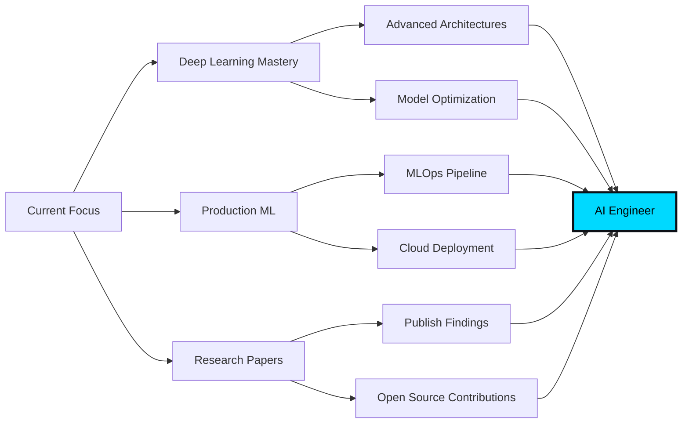

<!---
aminul01-g/aminul01-g is a ✨ special ✨ repository because its `README.md` (this file) appears on your GitHub profile.
--->

<div align="center">


<p align="center">
  <a href="https://www.linkedin.com/in/aminulai/"></a>
  <a href="https://aminul01-g.github.io/"></a>
  <a href="https://huggingface.co/aminul01-hg"></a>
  <a href="https://www.coursera.org/learner/aminul01"></a>
</p>


</div>

---

## 🎯 About Me

```python
class AI_MLEngineer:
    def __init__(self):
        self.name = "Aminul Islam Bhuiyan"
        self.role = "AI/ML Engineering Student"
        self.location = "Bangladesh 🇧🇩"
        self.passion = ["Deep Learning", "NLP", "Computer Vision", "LLMs"]
        self.goal = "Build research-grade AI systems that solve real-world problems"
        
    def current_focus(self):
        return {
            "learning": ["Advanced NLP", "Generative AI", "Model Optimization"],
            "building": ["LLM Applications", "Computer Vision Systems", "MLOps Pipelines"],
            "researching": ["Transformer Architectures", "RAG Systems", "Object Tracking"]
        }
    
    def future_vision(self):
        return "Bridging the gap between cutting-edge research and production deployment 🚀"
```

<div align="center">

### 🔥 Current Mission
**Building intelligent systems with Python, PyTorch, and Transformers to become a research-capable AI Engineer who can deploy and scale models in production**

</div>

---

## 🧠 Technical Arsenal

<table align="center">
<tr>
<td align="center" width="50%">

### 💻 Languages & Frameworks

<p align="center">

</p>


</td>
<td align="center" width="50%">

### 🤖 ML/DL Stack

<p align="center">


</p>

</td>
</tr>
<tr>
<td align="center" width="50%">

### 🛠️ Tools & Platforms

<p align="center">

</p>


</td>
<td align="center" width="50%">

### 🎯 Specializations

<p align="left">
✦ <b>Natural Language Processing</b><br>
✦ <b>Computer Vision</b><br>
✦ <b>Large Language Models</b><br>
✦ <b>Object Detection & Tracking</b><br>
✦ <b>Model Deployment & MLOps</b><br>
✦ <b>RAG Systems</b>
</p>

</td>
</tr>
</table>

---

## 🚀 Featured Projects

<div align="center">

### 🏆 Pinned Repositories

</div>

<table>
  <!-- Row 1: Agentic & RAG Systems -->
  <tr>
    <td width="50%" valign="top">
      <h3>🤖 <a href="https://github.com/aminul01-g/groq-langgraph-rag">Groq-LangGraph RAG Chatbot</a></h3>
      
      
      <br><br>
      <b>⚡ High-Performance AI Assistant</b>
      <ul>
        <li>Intelligent router switching dynamically between Pinecone RAG and Tavily web search.</li>
        <li>Advanced LangGraph orchestration for reliable multi-agent system state management.</li>
        <li>Blazing fast Groq inference engine integration for near-zero latency responses.</li>
      </ul>
      <b>🛠️ Tech Stack:</b> <code>LangGraph</code> <code>Groq</code> <code>Pinecone</code> <code>Tavily API</code> <code>RAG</code>
    </td>
    <td width="50%" valign="top">
      <h3>🌾 <a href="https://github.com/aminul01-g/krishi-bondhu">Krishi Bondhu (Farmer Assistant)</a></h3>
      
      
      <br><br>
      <b>⚡ Smart Agricultural Intelligence</b>
      <ul>
        <li>Dual-mode routing optimized for localized farming datasets and real-time agricultural web search.</li>
        <li>Advanced LangGraph workflow paired with high-speed Groq LLM inference.</li>
        <li>Dynamic knowledge retrieval tailored for crop disease management, pest control, and farming insights.</li>
      </ul>
      <b>🛠️ Tech Stack:</b> <code>LangGraph</code> <code>Groq</code> <code>Vector DB</code> <code>Tavily API</code> <code>Agri-RAG</code>
    </td>
  </tr>

  <!-- Row 2: AI Tools & Assistants -->
  <tr>
    <td width="50%" valign="top">
      <h3>🔍 <a href="https://github.com/aminul01-g/IntelliReview">IntelliReview</a></h3>
      
      
      <br><br>
      <b>⚡ Smart Static & Logical Code Analysis</b>
      <ul>
        <li>Seamless batch analysis supporting full multi-file uploads and complex repository folder structures.</li>
        <li>Automated detection of syntactic bugs, logical code smells, and potential performance bottlenecks.</li>
        <li>Context-aware software design pattern analysis with actionable, ready-to-merge optimization suggestions.</li>
      </ul>
      <b>🛠️ Tech Stack:</b> <code>LLM</code> <code>Code Review</code> <code>Static Analysis</code> <code>Multi-File Upload</code>
    </td>
    <td width="50%" valign="top">
      <h3>🤓 <a href="https://github.com/aminul01-g/ai_study_assistent_with-API-">AI Study Assistant</a></h3>
      
      
      <br><br>
      <b>⚡ Intelligent Learning Companion</b>
      <ul>
        <li>Interactive AI-driven study mentor powered by LLM API prompting engineering.</li>
        <li>Personalized quiz generation, summaries, and step-by-step topic breakdown capabilities.</li>
        <li>Lightweight Streamlit UI for seamless interactive session management and feedback loops.</li>
      </ul>
      <b>🛠️ Tech Stack:</b> <code>Python</code> <code>LLM APIs</code> <code>Streamlit</code> <code>Prompt Engineering</code>
    </td>
  </tr>

  <!-- Row 3: Computer Vision & NLP -->
  <tr>
    <td width="50%" valign="top">
      <h3>👥 <a href="https://github.com/aminul01-g/people-flow-tracker-yolov8">People Flow Tracker</a></h3>
      
      
      <br><br>
      <b>⚡ AI-Powered Surveillance System</b>
      <ul>
        <li>Real-time human detection and crowd flow tracking across customized security zones.</li>
        <li>Interactive entry/exit monitoring with heatmaps and line-crossing counts.</li>
        <li>State-of-the-art YOLOv8 object detection paired with ByteTrack multi-object tracker.</li>
      </ul>
      <b>🛠️ Tech Stack:</b> <code>YOLOv8</code> <code>ByteTrack</code> <code>OpenCV</code> <code>Python</code> <code>Object Tracking</code>
    </td>
    <td width="50%" valign="top">
      <h3>💬 <a href="https://github.com/aminul01-g/my-learning-hub/tree/main/07_DeepLearning/Next_Word_Prediction-LSTM">Next Word Prediction (LSTM)</a></h3>
      
      
      <br><br>
      <b>⚡ Sequence-to-Sequence NLP Model</b>
      <ul>
        <li>Word-level Long Short-Term Memory (LSTM) network designed for next-token probability distribution.</li>
        <li>Custom PyTorch pipeline containing tokenization, sequence padding, and tensor mapping.</li>
        <li>Robust training workflow optimizing cross-entropy loss with early stopping and text generation.</li>
      </ul>
      <b>🛠️ Tech Stack:</b> <code>PyTorch</code> <code>LSTM</code> <code>NLP</code> <code>Word Embeddings</code>
    </td>
  </tr>

  <!-- Row 4: Deep Learning & Explorations -->
  <tr>
    <td width="50%" valign="top">
      <h3>👔 <a href="https://github.com/aminul01-g/my-learning-hub/tree/main/07_DeepLearning/fashion-mnist-nn-vs-cnn">Fashion MNIST: NN vs CNN</a></h3>
      
      
      <br><br>
      <b>⚡ Comparative Deep Learning Study</b>
      <ul>
        <li>Comprehensive architecture benchmark comparing Multi-Layer Perceptrons and CNNs.</li>
        <li>Evaluation of regularization techniques including dropout, batch normalization, and weight decay.</li>
        <li>Rich visualizations of training/validation curves, confusion matrices, and misclassifications.</li>
      </ul>
      <b>🛠️ Tech Stack:</b> <code>PyTorch</code> <code>CNN</code> <code>Neural Networks</code> <code>Matplotlib</code>
    </td>
    <td width="50%" valign="top">
      <h3>🎯 <a href="https://github.com/aminul01-g?tab=repositories">Explore More Projects</a></h3>
      
      <br><br>
      <b>⚡ Open Source & Research Contributions</b>
      <ul>
        <li>Ongoing repository developments focusing on Deep Learning, NLP, Computer Vision, and LLM applications.</li>
        <li>Interested in collaborating on research-grade AI or deploying scalable ML/DL pipelines? Let's connect!</li>
      </ul>
      <b>👉 Visit my Repositories tab for full access!</b>
    </td>
  </tr>
</table>

---

## 📊 GitHub Analytics

<div align="center">


</div>

---

## 🎓 Learning Journey & Certifications

<div align="center">

<table>
<tr>
<td align="center" width="33%">

<br>
<sub><b>Neural Networks & Deep Learning</b></sub>
</td>
<td align="center" width="33%">

<br>
<sub><b>Advanced ML Techniques</b></sub>
</td>
<td align="center" width="33%">

<br>
<sub><b>Natural Language Processing</b></sub>
</td>
</tr>
</table>

🎯 **Active on:** [Coursera](https://www.coursera.org/learner/aminul01) | [Hugging Face](https://huggingface.co/aminul01-hg)

</div>

---

## 🎯 2025 Goals & Roadmap

<div align="center">



</div>

<table align="center">
<tr>
<td width="50%">

### 💡 Short-term Goals (Q1-Q2 2025)

- ✅ Master transformer architectures
- 🔄 Build 3+ production-ready ML apps
- 🔄 Contribute to Hugging Face models
- 📝 Write technical blog posts
- 🎯 Complete advanced NLP specialization

</td>
<td width="50%">

### 🚀 Long-term Vision (2025+)

- 🎯 Publish research papers
- 🌟 Contribute to major ML frameworks
- 🏆 Build AI products used by thousands
- 👨‍🏫 Mentor aspiring ML engineers
- 🌐 Establish strong ML community presence

</td>
</tr>
</table>

---

## 💼 What I'm Looking For

<div align="center">

<table>
<tr>
<td align="center" width="25%">

<br>
<b>Collaboration</b>
<br>
<sub>Open source ML projects</sub>
</td>
<td align="center" width="25%">

<br>
<b>Opportunities</b>
<br>
<sub>AI/ML internships & roles</sub>
</td>
<td align="center" width="25%">

<br>
<b>Learning</b>
<br>
<sub>Research collaborations</sub>
</td>
<td align="center" width="25%">

<br>
<b>Networking</b>
<br>
<sub>Connect with ML engineers</sub>
</td>
</tr>
</table>

</div>

---

## 📫 Let's Connect & Collaborate

<div align="center">

### 🌟 Open to discussions about AI, ML, and building cool stuff!

<p align="center">
  <a href="https://www.linkedin.com/in/aminulai/">
    
  </a>
  <a href="mailto:your.email@example.com">
    
  </a>
  <a href="https://aminul01-g.github.io/">
    
  </a>
  <a href="https://huggingface.co/aminul01-hg">
    
  </a>
</p>


### 💭 Philosophy That Drives Me

<br>


<br>

> ### *"Invent yourself, then share it with the world."* 🚀
> 
> I believe in building AI systems that are not just technically impressive,
> but also solve real problems and make a meaningful impact.

</div>

---

<div align="center">

### 🤝 Support My Work

If you find my projects helpful, consider:
- ⭐ Starring my repositories
- 🔄 Sharing with others who might benefit
- 💬 Providing feedback and suggestions
- 🤝 Collaborating on interesting projects

<br>

### 📈 Contribution Activity


</div>

---

<div align="center">


<sub>Made with ❤️ and lots of ☕</sub>
<br>
<sub>Last Updated: January 2025</sub>

</div>
